<div align="center">

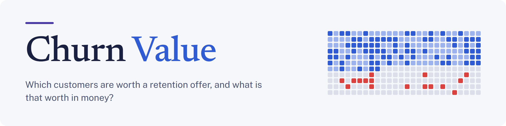

<a id="churn-value"></a>

### Profit-driven churn retention, on data that has no churn label

<br/>

<a href="https://churn-value.pedromarkovicz.workers.dev"></a>

<br/><br/>

[](https://github.com/PedroMarkovicz/churn-value/actions/workflows/ci.yml)
[](https://www.python.org/downloads/)
[](https://lightgbm.readthedocs.io/)
[](https://react.dev/)
[](https://www.typescriptlang.org/)
[](https://developers.cloudflare.com/workers/static-assets/)
[](LICENSE)

[Highlights](#highlights) •
[Results](#results) •
[The label](#building-the-label) •
[Architecture](#architecture) •
[Low-level design](#low-level-design) •
[Models](#model-ladder) •
[The site](#the-site) •
[Usage](#usage)

</div>

<p align="center">
  <a href="https://churn-value.pedromarkovicz.workers.dev">
    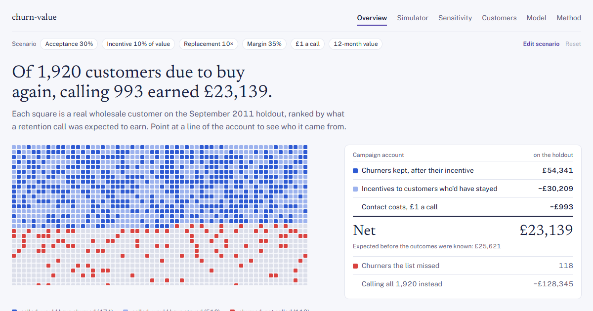
  </a>
  <br/>
  <em>The Overview page of the <a href="https://churn-value.pedromarkovicz.workers.dev">live site</a>: each square is one holdout customer, coloured by what calling them would have earned.</em>
</p>

---

## 📖 Overview

<div align="justify">

Churn Value decides which customers of a UK online wholesaler should get a retention offer, and reports what that decision is worth in pounds. It runs on [UCI Online Retail II](https://doi.org/10.24432/C5CG6D): two years of invoices, with no cancellation date and no churn column.

The project therefore starts one step earlier than most churn tutorials. It defines what "churned" means, builds the label from purchase behaviour, and then trains models. Models are compared on the profit of the campaign each would drive, with an interval around that profit. Ranking metrics are reported alongside.

> The pipeline is batch Python and publishes versioned artifacts. The site is static and needs no server: it reads those artifacts, recomputes the economics in the browser when an assumption changes, and runs the model itself for the what-if.

</div>

---

<a id="highlights"></a>
## ✨ Highlights

<table>
<tr>
<td width="50%">

### 🏷️ **A label built from behaviour**
- The data has purchases and no churn column
- Churn is defined per customer from their own buying rhythm
- Only customers who were due to reorder are labelled

</td>
<td width="50%">

### 💷 **Judged in money**
- Every policy gets an expected and a backtested profit
- 95% bootstrap intervals over customers
- The business assumptions are explicit and adjustable

</td>
</tr>
<tr>
<td width="50%">

### 🎯 **Calibration across seasons**
- Three models rank alike; one keeps its probabilities right
- The cutoff month as a feature is what holds calibration
- Checked on every monthly cutoff after training

</td>
<td width="50%">

### 🧱 **Leakage-safe by construction**
- Monthly snapshots: features see nothing after the cutoff
- Property-based tests mutate the future and expect no change
- Rolling-origin validation; the test cutoff is never fitted on

</td>
</tr>
<tr>
<td width="50%">

### 📦 **A versioned artifact contract**
- JSON Schemas shared by Python and TypeScript
- A SHA-256 per file, pinned in a lock file
- Golden vectors keep both sides computing the same numbers

</td>
<td width="50%">

### 🌐 **A static site that runs the model**
- Six pages, every number from the pinned release
- What-if inference in the browser with ONNX
- Deployed from CI after a smoke test, with a preview per pull request

</td>
</tr>
</table>

---

<a id="results"></a>
## 📈 Results

<div align="justify">

Three supervised models rank customers about equally well (ROC-AUC 0.76 to 0.77). Only one of them makes close to the money it promises.

On the September 2011 holdout, at the default assumptions:

</div>

| Policy | Customers called | Expected profit | Realized profit [95% CI] |
|---|---|---|---|
| Call everyone | 1,920 | – | −£128,345 [−£165,289, −£93,323] |
| Cadence rule | 1,920 | £155,221 | −£128,345 [−£165,289, −£93,323] |
| BG/NBD | 1,565 | £125,850 | −£23,067 [−£39,697, −£7,762] |
| Logistic regression | 1,367 | £67,245 | £8,089 [−£2,418, £18,773] |
| LightGBM | 1,294 | £62,859 | £14,972 [£5,941, £25,086] |
| **LightGBM + season** (deployed) | 993 | £25,621 | **£23,139 [£15,660, £31,729]** |
| Perfect foresight | 592 | – | £88,558 [£78,016, £98,844] |

<div align="justify">

No campaign was run. "Realized" is a backtest: what each list would have earned given who really stopped buying in the next 90 days, with the offer's acceptance rate (30%), the margin (35%), the incentive (10% of a customer's yearly margin) and the £1 contact cost still assumed. Intervals are 95% bootstrap intervals over customers.

An offer is priced with the model's probabilities, so a model that expects more churn than happens promises profit it never makes. Plain LightGBM expected £62,859 and would have made £14,972. Adding the cutoff month as a feature keeps the probabilities right after the season turns: the deployed model predicted 31.6% churn and 30.8% happened.

Refitted with six seeds, the deployed configuration realizes £19.4k to £23.1k. The table shows the pipeline's seed, which is at the top of that range.

</div>

---

<a id="building-the-label"></a>
## 🏷️ Building the label

<div align="justify">

Most public churn datasets come with a `churn` column. Transaction data from a retailer does not. A customer of a non-contractual business gives no notice when they leave; they stop ordering. Deciding who has churned is therefore part of the modelling, and a careless definition distorts every metric computed from it.

</div>

<p align="center">
  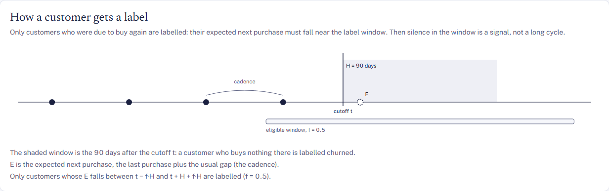
</p>

<div align="justify">

The definition used here has three parts:

</div>

1. **A cutoff and a horizon.** At a monthly cutoff `t`, features use only what happened up to `t`. The label looks at the next `H = 90` days.
2. **A cadence per customer.** `cadence = (last − first) / (purchase days − 1)`, and the expected next purchase is `E = last purchase + cadence`.
3. **Eligibility.** A customer is labelled only if `E` falls within `[t − f·H, t + H + f·H]`, with `f = 0.5`. They were due to buy, so silence in the window means something.

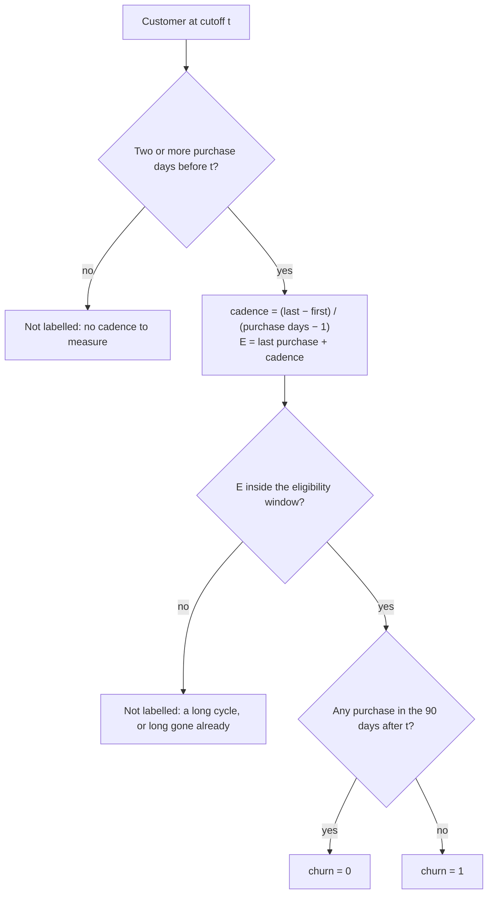

### Why this definition

| Practice | In this project |
|---|---|
| Define churn before modelling it | Inactivity over a fixed horizon, written down in [docs/design.md](docs/design.md) §3 and [ADR 0002](docs/adr/0002-label-fixed-horizon-cadence-eligibility.md) |
| Do not label customers whose silence is normal | The eligibility window drops long-cycle buyers and customers who were already gone, whose "churn" would be trivial to predict |
| Keep the future out of the features | 16 monthly snapshots; a property-based test changes transactions after `t` and requires every feature at `t` to stay the same |
| Validate the way the model will be used | Train on 10 past cutoffs, calibrate on June 2011, test on September 2011 |
| Report what the definition leaves out | One-time buyers have no cadence and are excluded; this is stated as a limit |

<div align="justify">

The result is 16 labelled snapshots with 1,298 to 2,163 eligible customers each, and a churn rate that moves between 24% and 52% with the calendar. The models later differ in how well they follow that seasonality.

</div>

---

<a id="architecture"></a>
## 🏗 Architecture

<div align="justify">

The high-level design has three parts: a batch pipeline, a versioned contract between the two languages, and a static site.

</div>

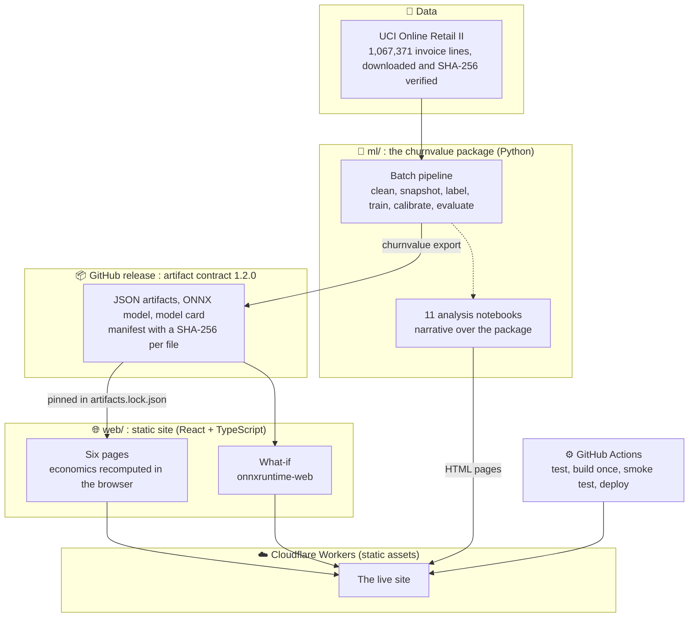

### 🎯 Layer responsibilities

| Layer | Responsibility | Consumers |
|---|---|---|
| 🔬 **Pipeline** (`ml/`) | Cleaning, snapshots, the label, features, baselines, training, calibration, evaluation with intervals, export. One Typer CLI is the single source of every artifact. | Notebooks, the release |
| 📓 **Notebooks** | The reasoning behind each decision. They import the package and read its outputs; no business rule lives in a notebook. | Readers, the site |
| 📦 **Contract** (`contracts/`) | JSON Schemas for every artifact and golden vectors both languages are tested against. | Pipeline, site |
| 🌐 **Site** (`web/`) | Loads and validates the release, recomputes the campaign under any scenario, explains each customer, runs the what-if. | Visitors |
| ⚙️ **CI/CD** | Tests both sides, checks the contract, builds the bundle once, smoke-tests it, deploys it, and gives each pull request a preview. | Every change |

---

<a id="low-level-design"></a>
## 🔬 Low-level design

### 1. The pipeline, stage by stage

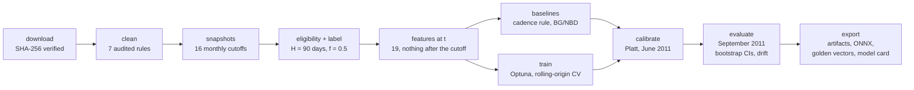

<div align="justify">

`uv run churnvalue pipeline` runs all of it and stops at the first stage that fails.

</div>

### 2. The decision for one customer

<div align="justify">

A call's expected profit is `E[π] = p·γ·(B − CRC) − (1 − p)·CRC − c`.

</div>

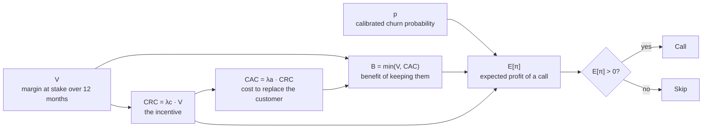

| Symbol | Meaning | Default |
|---|---|---|
| `p` | churn probability from the calibrated model | per customer |
| `γ` | share of contacted churners who accept the offer | 30% |
| `V` | margin the customer is expected to bring over 12 months | per customer, at a 35% margin |
| `CRC` | the incentive, `λc · V` | `λc` = 10% |
| `CAC` | what replacing the customer would cost, `λa · CRC` | `λa` = 10 |
| `B` | benefit of keeping them, `min(V, CAC)` | derived |
| `c` | cost of one contact | £1 |

<div align="justify">

With a budget, customers are ranked by `E[π]` and taken from the top until the expected spend or the number of calls reaches the limit.

</div>

### 3. What happens in the browser

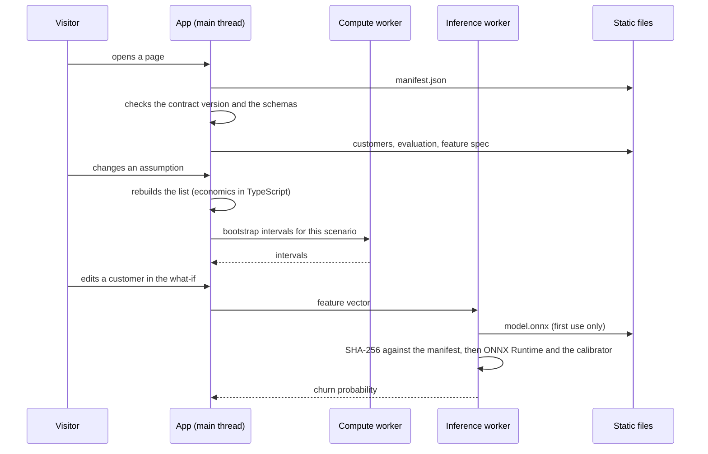

<div align="justify">

The scenario lives in the URL, so any set of assumptions, and any open customer, is a shareable link.

</div>

### 4. From a pull request to the live site

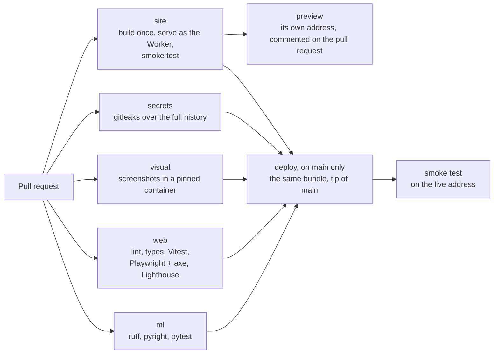

---

<a id="model-ladder"></a>
## 🪜 Model ladder

<div align="justify">

Each rung adds one idea, so the table shows what that idea is worth. All five are calibrated on June 2011 and tested on September 2011, a cutoff none was fitted, tuned or calibrated on. Actual churn there was 0.308.

</div>

| # | Model | How it scores a customer | ROC-AUC | Brier | Mean predicted churn |
|---|---|---|---|---|---|
| 1 | Cadence rule | How overdue the customer is against their own rhythm | 0.551 | 0.229 | 0.438 |
| 2 | BG/NBD | A buy-till-you-die model of purchase and dropout | 0.712 | 0.225 | 0.489 |
| 3 | Logistic regression | Linear model on the customer features | 0.761 | 0.190 | 0.416 |
| 4 | LightGBM | Gradient-boosted trees, tuned with Optuna under rolling-origin CV | 0.771 | 0.191 | 0.434 |
| 5 | **LightGBM + season** | The same, plus the cutoff month as two features | 0.766 | 0.176 | 0.316 |

<div align="justify">

Rungs 3 to 5 are within each other's intervals on ROC-AUC. They differ in the last column. Four of the five models expect far more churn than happened, which is why their expected profit in the [results](#results) is far from what they would have made.

The deployed model is exported to ONNX, explained per customer with SHAP, and described in the [model card](docs/model-card.md).

</div>

---

<a id="the-site"></a>
## 🖥️ The site

<table>
<tr>
<td width="50%">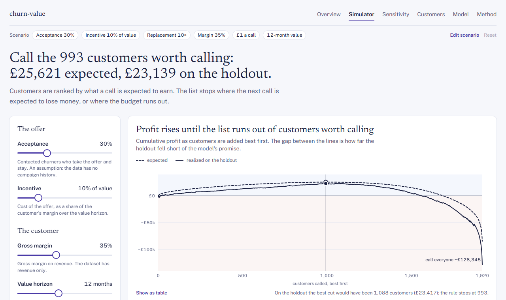<br/><sub><b>Simulator.</b> Change the assumptions; the list and its profit follow.</sub></td>
<td width="50%">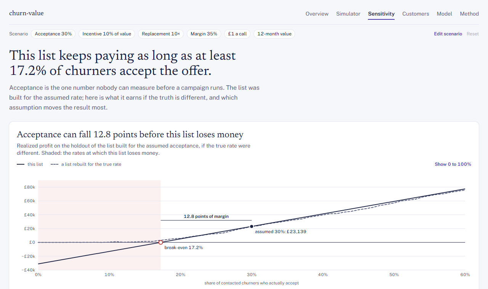<br/><sub><b>Sensitivity.</b> How far acceptance can fall before the list loses money.</sub></td>
</tr>
<tr>
<td width="50%">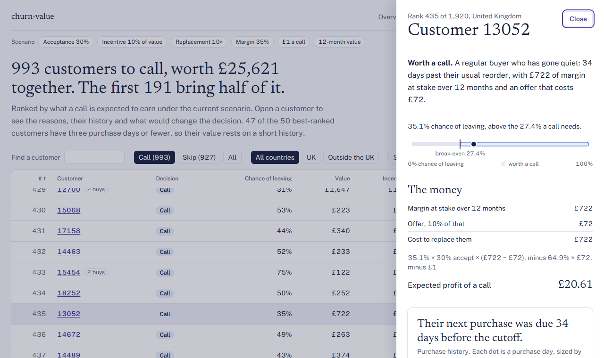<br/><sub><b>Customers.</b> The verdict for one customer, the money behind it, and a what-if.</sub></td>
<td width="50%">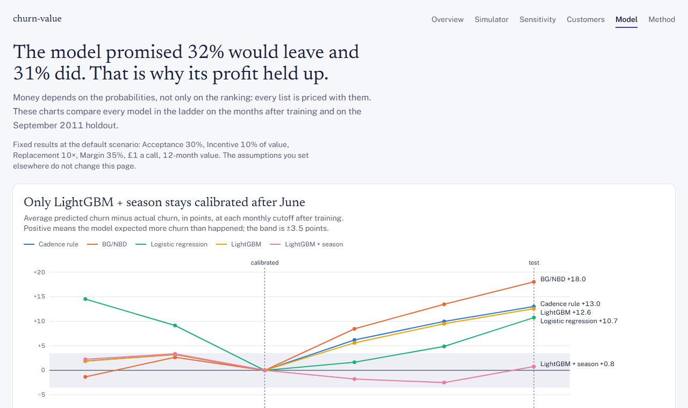<br/><sub><b>Model.</b> Calibration over time for every rung of the ladder.</sub></td>
</tr>
</table>

| Page | Question it answers |
|---|---|
| **Overview** | Is the model worth money? |
| **Simulator** | How many customers should we call? |
| **Sensitivity** | When does it stop paying? |
| **Customers** | Who exactly, and why? |
| **Model** | Can the probabilities be trusted? |
| **Method** | How was this built, and what can it not tell you? |

<div align="justify">

The eleven analysis notebooks are published with the site under [/notebooks/](https://churn-value.pedromarkovicz.workers.dev/notebooks/).

</div>

---

<a id="usage"></a>
## 💻 Usage

### Reproduce the pipeline

<div align="justify">

From the public dataset to the site's artifacts. Needs [uv](https://docs.astral.sh/uv/) 0.12 or newer.

</div>

```bash
cd ml
uv sync
uv run churnvalue pipeline
```

### Run the site

<div align="justify">

On the pinned release. Needs Node 24.

</div>

```bash
cd web
npm ci
npm run artifacts     # the pinned release, checksums verified
npm run dev           # http://localhost:5173
```

<div align="justify">

`npm run artifacts -- --local` uses the artifacts your own pipeline run exported. More in [ml/README.md](ml/README.md) and [web/README.md](web/README.md).

</div>

---

## 🛠 Development

### Tech stack

| Layer | Technology |
|---|---|
| **Data and features** | Python 3.12, pandas, Pandera, Pydantic |
| **Models** | scikit-learn, LightGBM, Optuna, a BG/NBD implementation, Platt calibration |
| **Explanations and tracking** | SHAP, MLflow |
| **Export** | ONNX, JSON Schema |
| **Site** | TypeScript, React, Vite, Tailwind CSS, TanStack Router, visx, onnxruntime-web |
| **Tests** | pytest, Hypothesis, Vitest, Playwright, axe, Lighthouse CI |
| **Delivery** | GitHub Actions, Cloudflare Workers, Wrangler |

### How it is checked

- **Python:** unit tests, property-based leakage tests (no feature may see the label window), and tests of the committed notebooks.
- **Contract:** the TypeScript types and validators are generated from the schemas, and CI fails if they drift.
- **Parity:** the site's economics and its ONNX inference reproduce the Python pipeline on golden vectors.
- **Site:** component tests; Playwright on desktop and a phone profile with accessibility checks on every page; visual regression in a pinned container; Lighthouse budgets.
- **Deploy:** the bundle is built once, served locally as the Worker will serve it and smoke-tested; `main` deploys that same bundle and checks the live address. Every pull request from a branch of this repository gets its own preview address.
- **History:** a secrets scan runs over the whole history on every pull request.

### The repository

| Path | What is there |
|---|---|
| [ml/](ml) | the `churnvalue` package and CLI, its tests, and the analysis notebooks |
| [web/](web) | the site: contract loader, economics, charts, pages, tests |
| [contracts/](contracts) | the JSON Schemas of the artifacts and the golden vectors both sides test against |
| [docs/](docs) | the [design document](docs/design.md), the [decision records](docs/adr) and the [model card](docs/model-card.md) |
| [.github/workflows/](.github/workflows) | CI and deploy, the manual training run, the manual notebooks run, the visual baselines |

---

## ⚠️ What it cannot tell you

- Whether an offer works: there is no campaign history, so the acceptance rate is an assumption.
- Anything about one-time buyers: a cadence needs two purchase days.
- A second season: the holdout is one autumn, and its 90 days run into the Christmas peak.
- New customers: the site scores the holdout; it does not take uploads.
- A blind test: an early prototype was scored on this holdout before the default incentive and the month features were fixed ([ADR 0003](docs/adr/0003-economics-emp-with-cac.md), [ADR 0005](docs/adr/0005-model-ladder-calibrated-gbdt.md)).

---

## 📄 Data and licence

<div align="justify">

Data: Chen, D. (2012). *Online Retail II* [Dataset]. UCI Machine Learning Repository. https://doi.org/10.24432/C5CG6D, licensed CC BY 4.0.

The raw dataset is downloaded by the pipeline and is not in this repository. Data derived from it is: the artifacts release (features, scores and purchase days of the 1,920 holdout customers, under the dataset's own customer numbers) and the notebooks' outputs. They remain under CC BY 4.0 with the citation above.

Code: [MIT](LICENSE).

</div>

---

<div align="center">

**Built with ☕ and a healthy distrust of accuracy scores**

[⬆ Back to top](#churn-value)

</div>
